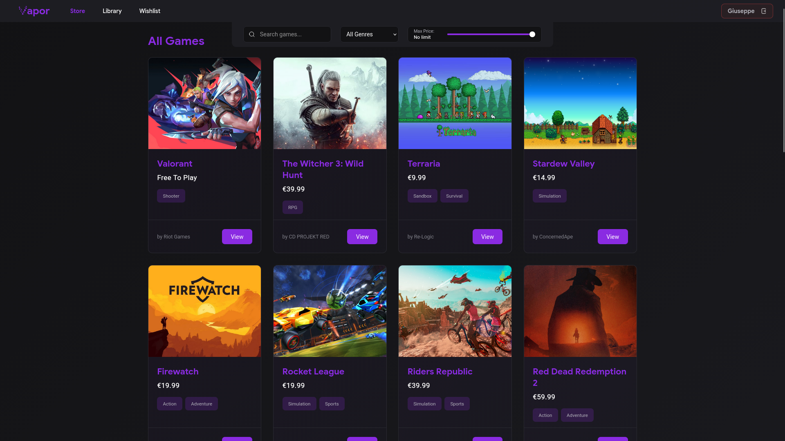
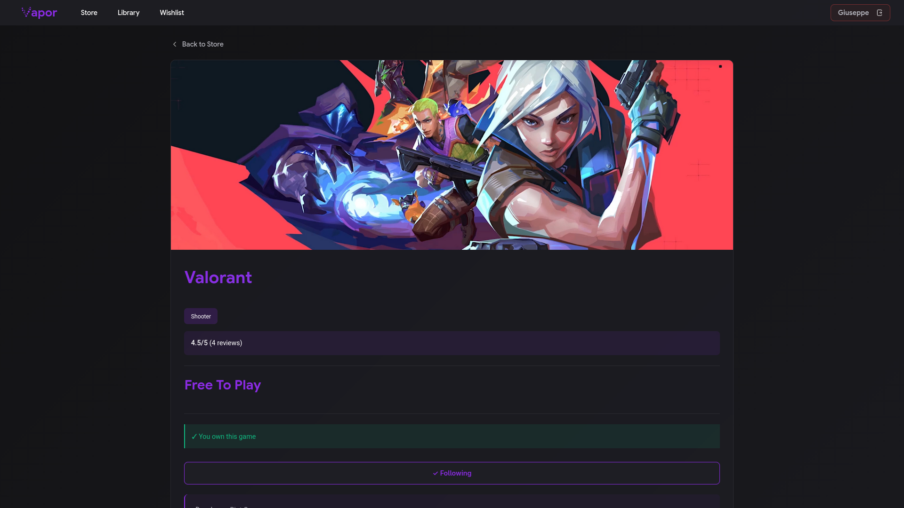
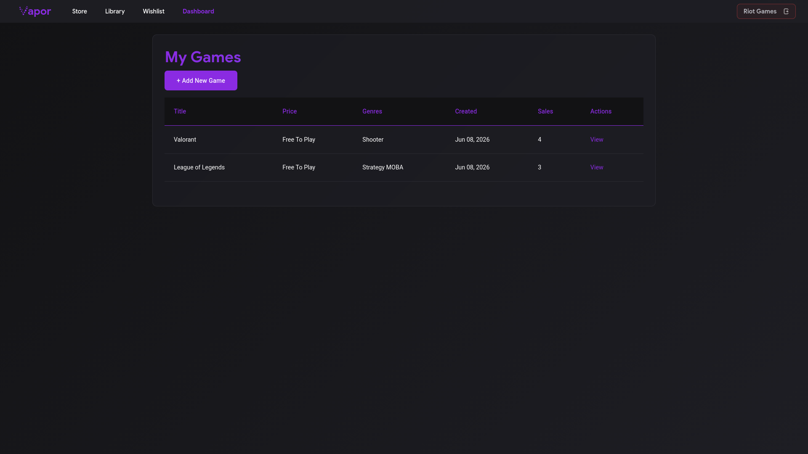

## **Vapor**

A video game store inspired by Steam, with different roles for permissions and dynamic AJAX features

### **Features**

* **Anonymous Users**
	* **Browsing**: Navigate the catalog to view available video games, prices, and average ratings.
	* **Search & Filters (AJAX)**: Search games by name and filter by maximum price or genre without page reloads.

* **Developers**
	* **Game Management**: Upload new video games with title, price, multiple genres, system requirements, and a cover image.
	* **Sales Analytics**: Access a dedicated statistics dashboard to monitor sales data and revenue generated by their published games.

* **Players**
	* **Purchases & Library**: Purchase video games and view them in a personal library.
	* **Reviews**: Write product reviews and view reviews from others.
	* **Rating (AJAX)**: Rate games using a numerical scoring system that instantly updates the global score average without page reloads.
	* **Developer Follow System (AJAX)**: Follow developers to see their releases directly on the personalized homepage.
	* **Wishlist (AJAX)**: Add games to a personal wishlist to save them for later.
	* **Recommendations**: View recommended titles on game detail pages based on genres.

---

### **Architecture**


---

### **Technologies**

* **Python (3.14.5)** 
* **Django (6.0.6)**
* **Pillow (12.2.0)**: For processing media uploads (game covers).
* **SQLite**: For a clean database.

---

### **Code Layout**

* `core/`: Main project configuration directory.
  * `settings.py`: Global settings.
  * `urls.py`: Root URL routing.
* `store/`: Main application directory.
  * `models.py`: Database tables.
  * `views.py`: Request processing logic.
  * `urls.py`: App-specific routing.
  * `tests.py`: Unit test cases.
  * `templates/`: HTML interface templates.
  * `static/`: Frontend style and JavaScript for AJAX logic.

---

### **Screenshots**

<details>
<summary>Catalog Page</summary>



</details>

<details>
<summary>Game Details Page</summary>



</details>

<details>
<summary>Dashboard Page</summary>



</details>

### **Usage**

After cloning the repository you can use the provided Makefile:

- **Initial setup (venv, requirements, admin user):**
    ```sh
    make setup
    ```

- **Load demo database and media:**
    ```sh
    make load
    ```

- **Save current database and media:**
    ```sh
    make save
    ```

- **Run local server:**
    ```sh
    make run
    ```

- **Run tests:**
    ```sh
    make test
    ```

- **Clean up (venv, database, media and cache):**
    ```sh
    make clean
    ```
